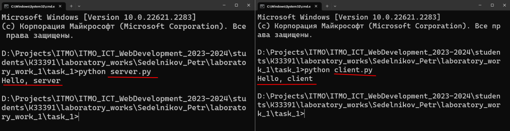
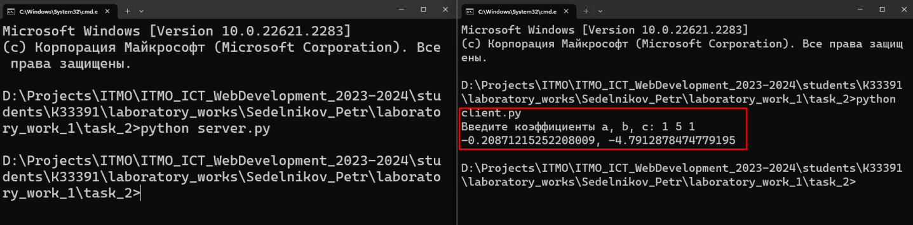
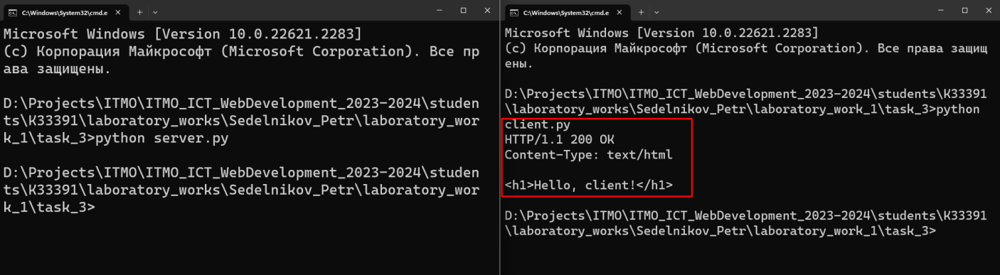
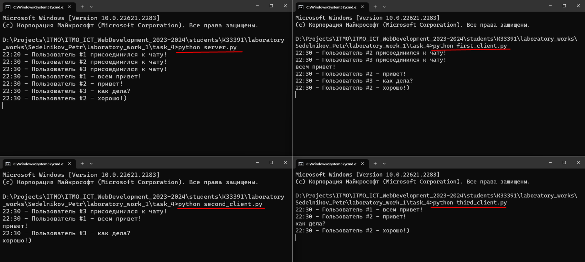
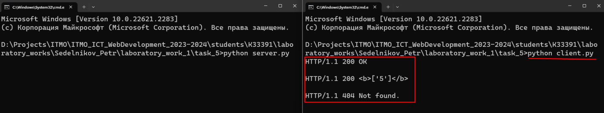

# Задание 1

Реализовать клиентскую и серверную часть приложения. Клиент отсылает серверу
сообщение «Hello, server». Сообщение должно отразиться на стороне сервера.
Сервер в ответ отсылает клиенту сообщение «Hello, client». Сообщение должно
отобразиться у клиента.

Обязательно использовать библиотеку socket

Реализовать с помощью протокола UDP

## Ход выполнения работы

### server.py:

    import socket

    server = socket.socket(socket.AF_INET, socket.SOCK_DGRAM)
    server.bind(('', 14900))

    data, client_address = server.recvfrom(16384)
    print(data.decode("UTF-8"))
    
    server.sendto(b"Hello, client", client_address)
    server.close()

### client.py:

    import socket

    server_address = ('localhost', 14900)

    client = socket.socket(socket.AF_INET, socket.SOCK_DGRAM)
    client.sendto(b"Hello, server", server_address)

    data = client.recv(16384)
    print(data.decode("UTF-8"))

    client.close()

## Результат

# Задание 2

Реализовать клиентскую и серверную часть приложения. Клиент запрашивает у
сервера выполнение математической операции, параметры, которые вводятся с
клавиатуры. Сервер обрабатывает полученные данные и возвращает результат
клиенту. Вариант: Решение квадратного уравнения

Обязательно использовать библиотеку socket

Реализовать с помощью протокола TCP

## Ход выполнения работы

### server.py
    import socket
    from math import sqrt
    
    def calculate_discriminant(a, b, c):
        return b ** 2 - 4 * a * c
    
    def get_answer(a, b, c):
        discriminant = calculate_discriminant(a, b, c)
        if discriminant < 0:
            return 'Error'
        elif discriminant == 0:
            x = -(b) / (2 * a)
            return str(x)
        else:
            x1 = (-(b) + sqrt(discriminant)) / (2 * a)
            x2 = (-(b) - sqrt(discriminant)) / (2 * a)
            return f"{x1}, {x2}"
    
    server = socket.socket(socket.AF_INET,socket.SOCK_STREAM)
    server.bind(('', 14900))
    server.listen(1)
    
    client_socket, client_address = server.accept()
    data = client_socket.recvfrom(16384)[0]
    coefficients = list(map(int, data.decode("UTF-8").split()))
    
    answer = get_answer(*coefficients)
    client_socket.send(bytes(answer, 'UTF-8'))
    
    client_socket.close()
    server.close()
    

### client.py
    import socket
    
    server_address = ('localhost', 14900)
    client = socket.socket(socket.AF_INET, socket.SOCK_STREAM)
    
    try:
        coefficients = list(map(int, input("Введите коэффициенты a, b, c: ").split()))
    except Exception:
        coefficients = None
        print('Ошибка! Неправильный формат коэффициентов!')
    
    if coefficients is not None:
        coefficients = bytes(' '.join([str(coefficient) for coefficient in coefficients]), 'UTF-8')

    client.connect(server_address)
    client.send(coefficients)

    data = client.recv(16384)
    print(data.decode("UTF-8"))

    client.close()

## Результат

# Задание 3

Реализовать серверную часть приложения. Клиент подключается к серверу. В ответ
клиент получает http-сообщение, содержащее html-страницу, которую сервер
подгружает из файла index.html.

Обязательно использовать библиотеку socket

## Ход выполнения работы

### server.py
    import socket
    
    html_file = open('index.html')
    html_data = '\n'.join(html_file.readlines())
    response_type = "HTTP/1.1 200 OK"
    content_type = "Content-Type: text/html"
    
    server = socket.socket(socket.AF_INET, socket.SOCK_STREAM)
    server.bind(('', 14900))
    server.listen(1)
    
    client_socket, client_address = server.accept()
    answer = f"{response_type}\n{content_type}\n\n{html_data}"
    client_socket.send(bytes(answer, 'UTF-8'))
    client_socket.close()
    server.close()

### client.py
    import socket
    
    server_address = ('localhost', 14900)
    client = socket.socket(socket.AF_INET,socket.SOCK_STREAM)
    client.connect(server_address)
    
    data = client.recv(16384)
    print(data.decode("UTF-8"))
    
    client.close()

### index.html

    <h1>Hello, client!</h1>

## Результат

# Задание 4

Реализовать двухпользовательский или многопользовательский чат. Реализация
многопользовательского часа позволяет получить максимальное количество
баллов.

Обязательно использовать библиотеку threading

## Ход выполнения работы

### server.py
    import socket
    import threading
    from datetime import datetime

    users = []
    
    server = socket.socket(socket.AF_INET, socket.SOCK_STREAM)
    server.bind(('', 14900))
    server.listen(1)
    
    
    def print_message(data):
        message_time = datetime.now()
        message_hour = str(message_time.hour).ljust(2, '0')
        message_minute = str(message_time.minute).ljust(2, '0')
        print(f"{message_hour}:{message_minute} - {data}")
    
    def send_message(data, sender_id):
        message_time = datetime.now()
        message_hour = str(message_time.hour).ljust(2, '0')
        message_minute = str(message_time.minute).ljust(2, '0')
        data = f"{message_hour}:{message_minute} - {data}".encode('utf-8')
        for user_index, user in enumerate(users):
            if user_index + 1 != sender_id:
                user.send(data)
    
    def listen(client_socket):
        while True:
            data = client_socket.recv(16384)
            user_id = users.index(client_socket) + 1
            line = f"Пользователь #{user_id} - {data.decode('UTF-8')}"
            print_message(line)
            send_message(line, user_id)
    
    
    while True:
        client_socket, client_address = server.accept()
        if client_socket not in users:
            users.append(client_socket)

    user_id = users.index(client_socket) + 1
    line = f"Пользователь #{user_id} присоединился к чату!"
    print_message(line)
    send_message(line, user_id)

    listen_thread = threading.Thread(target=listen, args=(client_socket,))
    listen_thread.start()

    server.close()

### client.py
    import socket
    import threading
    
    server_address = ('localhost', 14900)
    client = socket.socket(socket.AF_INET, socket.SOCK_STREAM)
    client.connect(server_address)
    
    def listen():
        while True:
            data = client.recv(16384)
            print(data.decode('UTF-8'))
    
    def polling():
        while True:
            data = input()
            client.send(data.encode('utf-8'))
    
    
    listen_thread = threading.Thread(target=listen)
    listen_thread.start()
    
    polling_thread = threading.Thread(target=polling)
    polling_thread.start()

## Результат

# Задание 5

Необходимо написать простой web-сервер для обработки GET и POST http
запросов средствами Python и библиотеки socket.

## Ход выполнения работы

### Код server.py

    import socket
    import sys
    
    
    class Response:
        def __init__(self, status, reason, headers=None, body=None):
            self.status = status
            self.reason = reason
            self.headers = headers
            self.body = body
    
    
    class MyHTTPServer:
        def __init__(self, host, port):
            self.host = host
            self.port = port
            self.marks = {}

    def serve_forever(self):
        server = socket.socket(socket.AF_INET, socket.SOCK_STREAM)
        server.bind((self.host, self.port))
        server.listen()

        while True:
            client_socket, client_address = server.accept()
            self.serve_client(client_socket)

    def serve_client(self, client_socket):
        data, http_method, params_dict = self.parse_request(client_socket)
        headers = self.parse_headers(data)
        resp = self.handle_request(http_method, params_dict)
        self.send_response(client_socket, resp)

    def parse_request(self, client_socket):
        data = client_socket.recv(16384).decode("UTF-8").split('\n')
        http_method, http_url, http_version = data[0].split()
        params_dict = {}
        try:
            params = http_url.split("?")[1].split("&")
        except Exception as e:
            print(str(e))
            params = []
        if http_url == '/favicon.ico':
            params_dict = {}
        for param in params:
            name, value = param.split('=')
            params_dict[name] = value
        return data, http_method, params_dict

    def parse_headers(self, data):
        headers = []
        for line in data:
            if line == '':
                break
            headers.append(line)
        return headers

    def handle_request(self, http_method, params_dict):
        if http_method == 'POST':
            name = params_dict['name']
            value = params_dict['value']
            if name in self.marks:
                self.marks[name].append(value)
            else:
                self.marks[name] = [value]
            return Response(200, 'OK', body='OK')
        elif http_method == 'GET':
            if params_dict == {}:
                return Response(404, 'Not found')
            name = params_dict['name']
            if name in self.marks:
                marks = self.marks[name]
                return Response(200, 'OK', body=f"<b>{name}: {marks}</b>")
            else:
                return Response(404, 'Not found')

    def send_response(self, client_socket, resp):
        response = f"HTTP/1.1 {resp.status} {resp.reason}\nContent-Type: text/html\n\n{resp.body}"
        client_socket.send(response.encode("UTF-8"))
        client_socket.close()

    if __name__ == '__main__':
        host = 'localhost'
        port = 14900
        server = MyHTTPServer(host, port)
        server.serve_forever()

### client.py

    import socket

    server_address = ('localhost', 14900)
    
    def send_mark(name, value):
        http_method = 'POST'
        http_url = f"isu.ifmo.ru/pls/apex/f?name={name}&value={value}"
        http_version = "HTTP/1.1"
        data = f"{http_method} {http_url} {http_version}\nHost: example.local\n"

    client = socket.socket(socket.AF_INET, socket.SOCK_STREAM)
    client.connect(server_address)
    client.send(bytes(data, 'UTF-8'))

    data = client.recv(16384)
    print(data.decode("UTF-8"))

    client.close()

    def get_marks(name):
        http_method = 'GET'
        http_url = f"isu.ifmo.ru/pls/apex/f?name={name}"
        http_version = "HTTP/1.1"
        data = f"{http_method} {http_url} {http_version}\nHost: example.local\n"

    client = socket.socket(socket.AF_INET, socket.SOCK_STREAM)
    client.connect(server_address)
    client.send(bytes(data, 'UTF-8'))

    data = client.recv(16384)
    print(data.decode("UTF-8"))

    client.close()

    send_mark('ООП', 5)
    get_marks('ООП')
    get_marks('Математика')

## Результат

