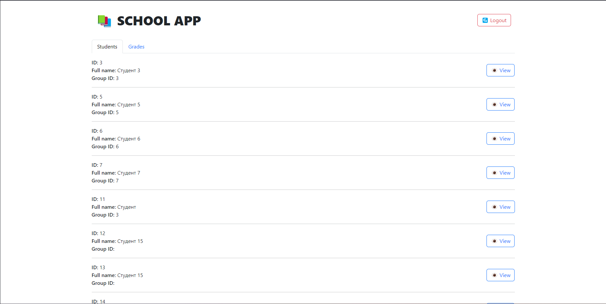
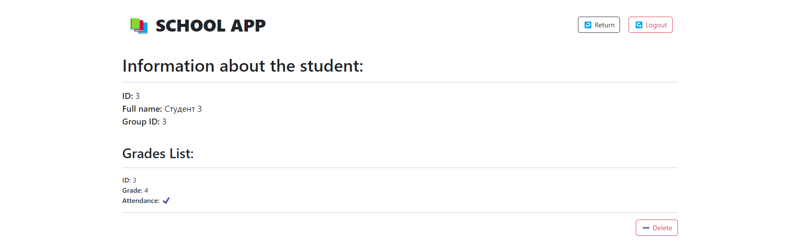
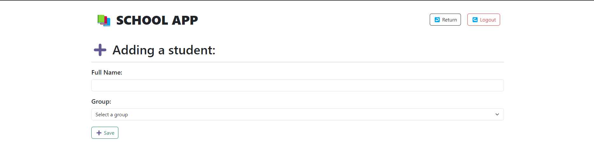
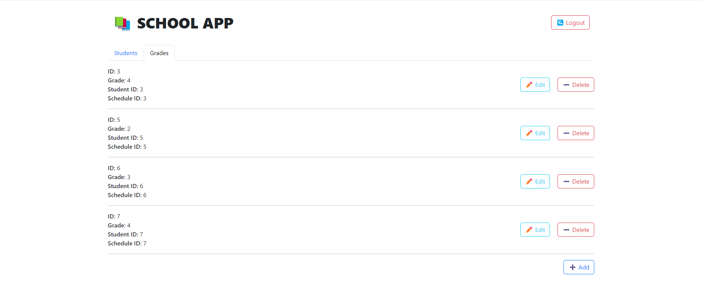
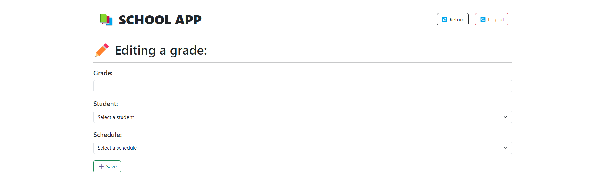
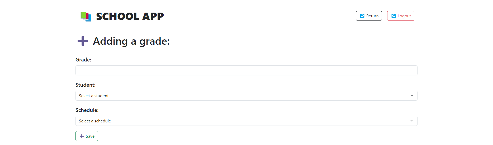

# Лабораторная работа №4

- Выполнить практическую работу 4.1 Базовые конструкции языка JavaScript). (https://docs.google.com/document/d/1lurVq_ddbKQ-rORvxF3T9PlPPy-sOgHwFazCI0yEqYY/edit?usp=sharing)
- Выполнить практическую работу 4.2. Работа с Vue.JS. (https://docs.google.com/document/d/1kSXkW6Vcis8z-TunNALcapCVmMHps3jaDdIP4rZkV9E/edit?usp=sharing)
- Настроить для серверной части, реализованной в лабораторной работе №3 CORS (Cross-origin resource sharing) в соответствии с Практической работой 4.3
- Утвердить с одним из преподавателей список интерфейсов для взаимодействия с серверной частью в соответствии с вашей предметной областью (это очень важный пункт, тк бывает такое, что не все студенты понимают суть своих вариантов).
- Реализовать интерфейсы авторизации, регистрации и изменения учётных данных и настроить взаимодействие с серверной частью. 
- Реализовать клиентские интерфейсы и настроить взаимодействие с серверной частью (интерфейсы из пункта 4). Полезные материалы:
- Подключить vuetify или аналогичную библиотеку. Полезные материалы:
- Реализовать документацию, описывающую работу разработанных интерфейсов средствами MkDocs.

## Ход выполнения работы

### Страница авторизации:

### Страница регистрации:

### Просмотр студентов:

### Просмотр информации о студенте:

### Добавление студента:

### Список оценок:

### Редактирование оценки:

### Добавление оценки:

