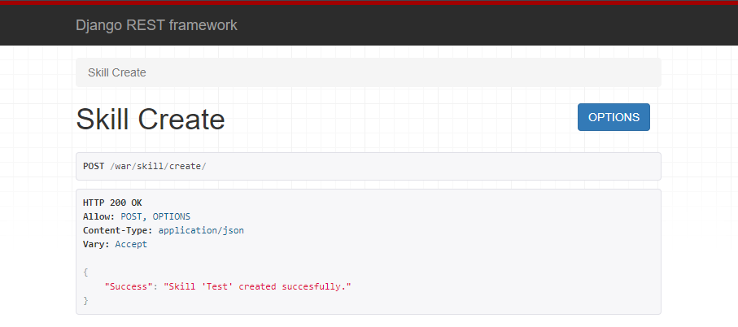
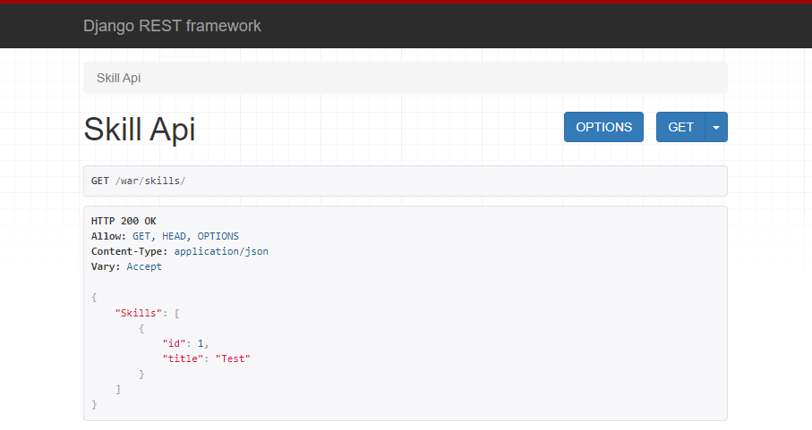
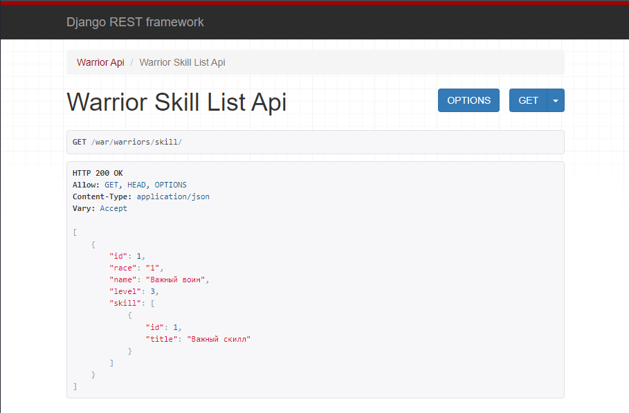
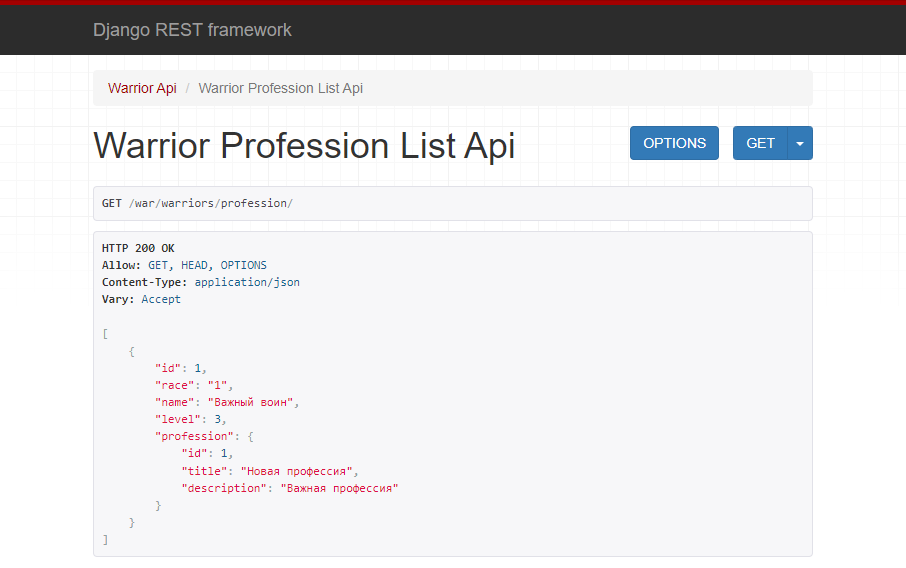
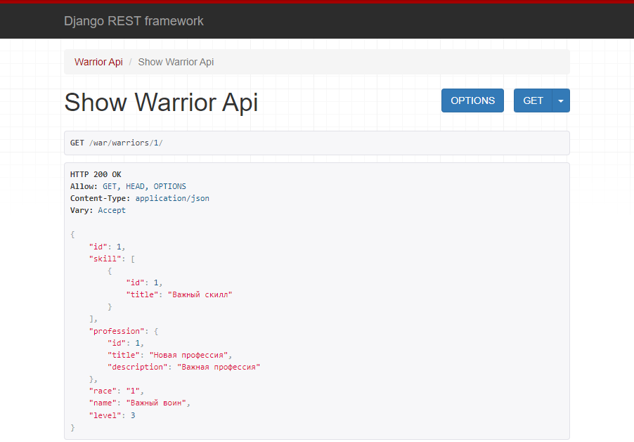
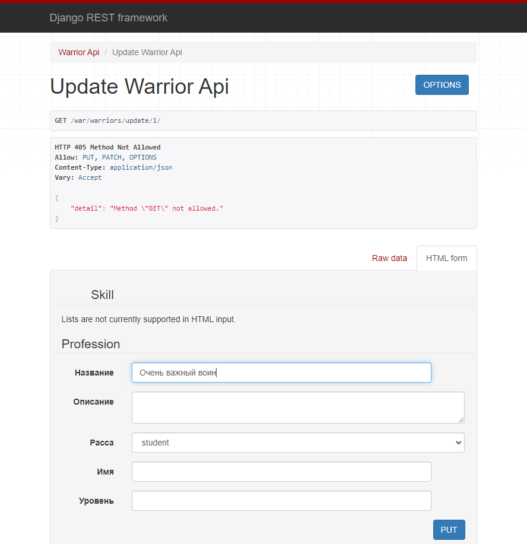
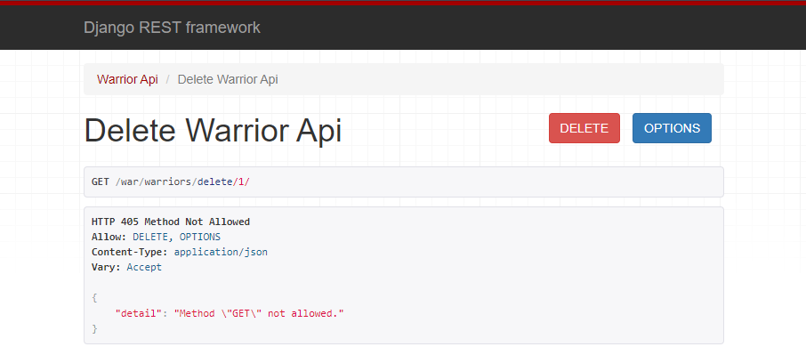

# Практическое задание 3.2

## Задание 1

Реализовать ендпоинты для добавления и просмотра скилов методом, описанным в пункте выше.

### serializers.py:

    class SkillSerializer(serializers.ModelSerializer):
        class Meta:
            model = Skill
            fields = "__all__"

### views.py:

    class SkillAPIView(APIView):
       def get(self, request):
           skills = Skill.objects.all()
           serializer = SkillSerializer(skills, many=True)
           return Response({"Skills": serializer.data})

    class SkillCreateSerializer(serializers.Serializer):
        title = serializers.CharField(max_length=120)
    
        def create(self, validated_data):
            skill_model_inst = Skill(**validated_data)
            skill_model_inst.save()
            return skill_model_inst
    
        def update(self, instance, validated_data):
            pass

## Задание 2

Вывод полной информации о всех войнах и их профессиях (в одном запросе).

### serializers.py:

    class WarriorProfessionSerializer(serializers.ModelSerializer):
        profession = ProfessionSerializer(many=False)
        class Meta:
            model = Warrior
            fields = ["id", "race", "name", "level", "profession"]

### views.py:

    class WarriorProfessionListAPIView(generics.ListAPIView):
        serializer_class = WarriorProfessionSerializer
        queryset = Warrior.objects.all()

Вывод полной информации о всех войнах и их скилах (в одном запросе).

### serializers.py:

    class WarriorSkillSerializer(serializers.ModelSerializer):
        skill = SkillSerializer(many=True)

        class Meta:
            model = Warrior
            fields = ["id", "race", "name", "level", "skill"]

### views.py:

    class WarriorSkillListApiView(generics.ListAPIView):
        serializer_class = WarriorSkillSerializer
        queryset = Warrior.objects.all()

Вывод полной информации о войне (по id), его профессиях и скилах.

### serializers.py:

    class OneWarriorSerializer(serializers.ModelSerializer,):
        skill = SkillSerializer(many=True)
        profession = ProfessionSerializer(many=False)
    
        class Meta:
            model = Warrior
            fields = "__all__"

### views.py:

    class ShowWarriorAPIView(generics.RetrieveAPIView):
        serializer_class = OneWarriorSerializer
        queryset = Warrior.objects.all()

Удаление война по id.

### views.py:

    class DeleteWarriorAPIView(generics.DestroyAPIView):
        serializer_class = OneWarriorSerializer
        queryset = Warrior.objects.all()

Редактирование информации о войне.

### views.py:

    class UpdateWarriorAPIView(UpdateAPIView):
        serializer_class = OneWarriorSerializer
        queryset = Warrior.objects.all()

