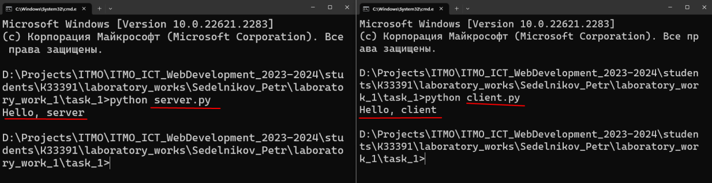

# Задание 1

Реализовать клиентскую и серверную часть приложения. Клиент отсылает серверу
сообщение «Hello, server». Сообщение должно отразиться на стороне сервера.
Сервер в ответ отсылает клиенту сообщение «Hello, client». Сообщение должно
отобразиться у клиента.

Обязательно использовать библиотеку socket

Реализовать с помощью протокола UDP

## Ход выполнения работы

### server.py:

    import socket

    server = socket.socket(socket.AF_INET, socket.SOCK_DGRAM)
    server.bind(('', 14900))

    data, client_address = server.recvfrom(16384)
    print(data.decode("UTF-8"))
    
    server.sendto(b"Hello, client", client_address)
    server.close()

### client.py:

    import socket

    server_address = ('localhost', 14900)

    client = socket.socket(socket.AF_INET, socket.SOCK_DGRAM)
    client.sendto(b"Hello, server", server_address)

    data = client.recv(16384)
    print(data.decode("UTF-8"))

    client.close()

## Результат

