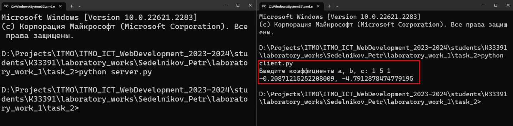

# Задание 2

Реализовать клиентскую и серверную часть приложения. Клиент запрашивает у
сервера выполнение математической операции, параметры, которые вводятся с
клавиатуры. Сервер обрабатывает полученные данные и возвращает результат
клиенту. Вариант: Решение квадратного уравнения

Обязательно использовать библиотеку socket

Реализовать с помощью протокола TCP

## Ход выполнения работы

### server.py
    import socket
    from math import sqrt
    
    def calculate_discriminant(a, b, c):
        return b ** 2 - 4 * a * c
    
    def get_answer(a, b, c):
        discriminant = calculate_discriminant(a, b, c)
        if discriminant < 0:
            return 'Error'
        elif discriminant == 0:
            x = -(b) / (2 * a)
            return str(x)
        else:
            x1 = (-(b) + sqrt(discriminant)) / (2 * a)
            x2 = (-(b) - sqrt(discriminant)) / (2 * a)
            return f"{x1}, {x2}"
    
    server = socket.socket(socket.AF_INET,socket.SOCK_STREAM)
    server.bind(('', 14900))
    server.listen(1)
    
    client_socket, client_address = server.accept()
    data = client_socket.recvfrom(16384)[0]
    coefficients = list(map(int, data.decode("UTF-8").split()))
    
    answer = get_answer(*coefficients)
    client_socket.send(bytes(answer, 'UTF-8'))
    
    client_socket.close()
    server.close()
    

### client.py
    import socket
    
    server_address = ('localhost', 14900)
    client = socket.socket(socket.AF_INET, socket.SOCK_STREAM)
    
    try:
        coefficients = list(map(int, input("Введите коэффициенты a, b, c: ").split()))
    except Exception:
        coefficients = None
        print('Ошибка! Неправильный формат коэффициентов!')
    
    if coefficients is not None:
        coefficients = bytes(' '.join([str(coefficient) for coefficient in coefficients]), 'UTF-8')

    client.connect(server_address)
    client.send(coefficients)

    data = client.recv(16384)
    print(data.decode("UTF-8"))

    client.close()

## Результат

