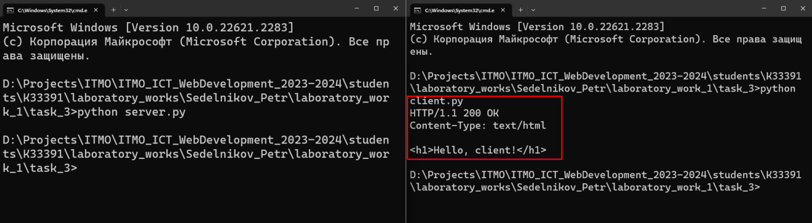

# Задание 3

Реализовать серверную часть приложения. Клиент подключается к серверу. В ответ
клиент получает http-сообщение, содержащее html-страницу, которую сервер
подгружает из файла index.html.

Обязательно использовать библиотеку socket

## Ход выполнения работы

### server.py
    import socket
    
    html_file = open('index.html')
    html_data = '\n'.join(html_file.readlines())
    response_type = "HTTP/1.1 200 OK"
    content_type = "Content-Type: text/html"
    
    server = socket.socket(socket.AF_INET, socket.SOCK_STREAM)
    server.bind(('', 14900))
    server.listen(1)
    
    client_socket, client_address = server.accept()
    answer = f"{response_type}\n{content_type}\n\n{html_data}"
    client_socket.send(bytes(answer, 'UTF-8'))
    client_socket.close()
    server.close()

### client.py
    import socket
    
    server_address = ('localhost', 14900)
    client = socket.socket(socket.AF_INET,socket.SOCK_STREAM)
    client.connect(server_address)
    
    data = client.recv(16384)
    print(data.decode("UTF-8"))
    
    client.close()

### index.html

    <h1>Hello, client!</h1>

## Результат

