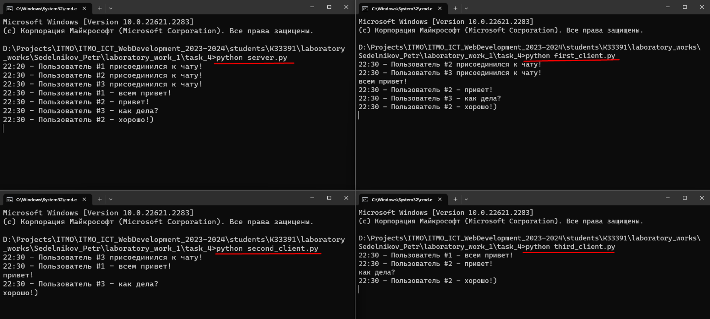

# Задание 4

Реализовать двухпользовательский или многопользовательский чат. Реализация
многопользовательского часа позволяет получить максимальное количество
баллов.

Обязательно использовать библиотеку threading

## Ход выполнения работы

### server.py
    import socket
    import threading
    from datetime import datetime

    users = []
    
    server = socket.socket(socket.AF_INET, socket.SOCK_STREAM)
    server.bind(('', 14900))
    server.listen(1)
    
    
    def print_message(data):
        message_time = datetime.now()
        message_hour = str(message_time.hour).ljust(2, '0')
        message_minute = str(message_time.minute).ljust(2, '0')
        print(f"{message_hour}:{message_minute} - {data}")
    
    def send_message(data, sender_id):
        message_time = datetime.now()
        message_hour = str(message_time.hour).ljust(2, '0')
        message_minute = str(message_time.minute).ljust(2, '0')
        data = f"{message_hour}:{message_minute} - {data}".encode('utf-8')
        for user_index, user in enumerate(users):
            if user_index + 1 != sender_id:
                user.send(data)
    
    def listen(client_socket):
        while True:
            data = client_socket.recv(16384)
            user_id = users.index(client_socket) + 1
            line = f"Пользователь #{user_id} - {data.decode('UTF-8')}"
            print_message(line)
            send_message(line, user_id)
    
    
    while True:
        client_socket, client_address = server.accept()
        if client_socket not in users:
            users.append(client_socket)

    user_id = users.index(client_socket) + 1
    line = f"Пользователь #{user_id} присоединился к чату!"
    print_message(line)
    send_message(line, user_id)

    listen_thread = threading.Thread(target=listen, args=(client_socket,))
    listen_thread.start()

    server.close()

### client.py
    import socket
    import threading
    
    server_address = ('localhost', 14900)
    client = socket.socket(socket.AF_INET, socket.SOCK_STREAM)
    client.connect(server_address)
    
    def listen():
        while True:
            data = client.recv(16384)
            print(data.decode('UTF-8'))
    
    def polling():
        while True:
            data = input()
            client.send(data.encode('utf-8'))
    
    
    listen_thread = threading.Thread(target=listen)
    listen_thread.start()
    
    polling_thread = threading.Thread(target=polling)
    polling_thread.start()

## Результат

