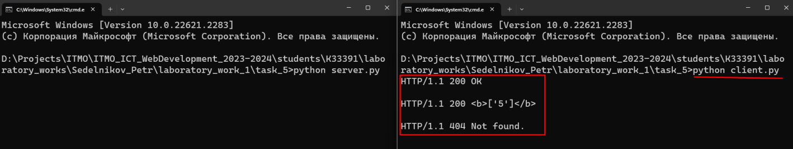

# Задание 5

Необходимо написать простой web-сервер для обработки GET и POST http
запросов средствами Python и библиотеки socket.

## Ход выполнения работы

### Код server.py

    import socket
    import sys
    
    
    class Response:
        def __init__(self, status, reason, headers=None, body=None):
            self.status = status
            self.reason = reason
            self.headers = headers
            self.body = body
    
    
    class MyHTTPServer:
        def __init__(self, host, port):
            self.host = host
            self.port = port
            self.marks = {}

    def serve_forever(self):
        server = socket.socket(socket.AF_INET, socket.SOCK_STREAM)
        server.bind((self.host, self.port))
        server.listen()

        while True:
            client_socket, client_address = server.accept()
            self.serve_client(client_socket)

    def serve_client(self, client_socket):
        data, http_method, params_dict = self.parse_request(client_socket)
        headers = self.parse_headers(data)
        resp = self.handle_request(http_method, params_dict)
        self.send_response(client_socket, resp)

    def parse_request(self, client_socket):
        data = client_socket.recv(16384).decode("UTF-8").split('\n')
        http_method, http_url, http_version = data[0].split()
        params_dict = {}
        try:
            params = http_url.split("?")[1].split("&")
        except Exception as e:
            print(str(e))
            params = []
        if http_url == '/favicon.ico':
            params_dict = {}
        for param in params:
            name, value = param.split('=')
            params_dict[name] = value
        return data, http_method, params_dict

    def parse_headers(self, data):
        headers = []
        for line in data:
            if line == '':
                break
            headers.append(line)
        return headers

    def handle_request(self, http_method, params_dict):
        if http_method == 'POST':
            name = params_dict['name']
            value = params_dict['value']
            if name in self.marks:
                self.marks[name].append(value)
            else:
                self.marks[name] = [value]
            return Response(200, 'OK', body='OK')
        elif http_method == 'GET':
            if params_dict == {}:
                return Response(404, 'Not found')
            name = params_dict['name']
            if name in self.marks:
                marks = self.marks[name]
                return Response(200, 'OK', body=f"<b>{name}: {marks}</b>")
            else:
                return Response(404, 'Not found')

    def send_response(self, client_socket, resp):
        response = f"HTTP/1.1 {resp.status} {resp.reason}\nContent-Type: text/html\n\n{resp.body}"
        client_socket.send(response.encode("UTF-8"))
        client_socket.close()

    if __name__ == '__main__':
        host = 'localhost'
        port = 14900
        server = MyHTTPServer(host, port)
        server.serve_forever()

### client.py

    import socket

    server_address = ('localhost', 14900)
    
    def send_mark(name, value):
        http_method = 'POST'
        http_url = f"isu.ifmo.ru/pls/apex/f?name={name}&value={value}"
        http_version = "HTTP/1.1"
        data = f"{http_method} {http_url} {http_version}\nHost: example.local\n"

    client = socket.socket(socket.AF_INET, socket.SOCK_STREAM)
    client.connect(server_address)
    client.send(bytes(data, 'UTF-8'))

    data = client.recv(16384)
    print(data.decode("UTF-8"))

    client.close()

    def get_marks(name):
        http_method = 'GET'
        http_url = f"isu.ifmo.ru/pls/apex/f?name={name}"
        http_version = "HTTP/1.1"
        data = f"{http_method} {http_url} {http_version}\nHost: example.local\n"

    client = socket.socket(socket.AF_INET, socket.SOCK_STREAM)
    client.connect(server_address)
    client.send(bytes(data, 'UTF-8'))

    data = client.recv(16384)
    print(data.decode("UTF-8"))

    client.close()

    send_mark('ООП', 5)
    get_marks('ООП')
    get_marks('Математика')

## Результат

