# Лабораторная работа №3

Создать программную систему, предназначенную для завуча школы. Она должна
обеспечивать хранение сведений о каждом учителе, классном руководстве, о предметах,
которые он преподает в заданный период, номере закрепленного за ним кабинета, о
расписании занятий. Существуют учителя, которые не имеют собственного кабинета.
Об учениках должны храниться следующие сведения: фамилия и имя, в каком классе
учится, какую оценку имеет в текущей четверти по каждому предмету.

Завуч должен иметь возможность добавить сведения о новом учителе или
ученике, внести в базу данных четвертные оценки учеников каждого класса по каждому
предмету, удалить данные об уволившемся учителе и отчисленном из школы ученике,
внести изменения в данные об учителях и учениках, в том числе поменять оценку ученика
по тому или иному предмету. В задачу завуча входит также составление расписания.

## Ход выполнения работы

### models.py:

    class Classes(models.Model):
        litera_types = (
            ('A', 'А'),
            ('B', 'Б'),
            ('V', 'В'),
            ('G', 'Г'),
        )
        teacher = models.ForeignKey(
            'Teachers',
            on_delete=models.CASCADE,
            verbose_name='Классный руководитель',
            blank=True,
            null=True
        )
        year = models.IntegerField(verbose_name='Год обучения')
        litera = models.CharField(
            max_length=1,
            choices=litera_types,
            verbose_name='Буква'
        )
        teachings = models.ManyToManyField(
            'Teachings',
            verbose_name='Преподавания',
            through='Schedules',
            related_name='class_teachings'
        )
    
    
    class Teachers(models.Model):
        cabinet = models.OneToOneField('Cabinets', on_delete=models.CASCADE, primary_key=False, blank=True, null=True)
        FIO = models.CharField(max_length=120, verbose_name='ФИО')
        subjects = models.ManyToManyField(
            'Subjects',
            verbose_name='Предметы',
            through='Teachings',
            related_name='teacher_subjects'
        )
    
    
    class Cabinets(models.Model):
        number = models.IntegerField(verbose_name='Номер')
        floor = models.IntegerField(verbose_name='Этаж')
    
    
    class Subjects(models.Model):
        subject_types = (
            ('Math', 'Математика'),
            ('Physics', 'Физика'),
            ('Arts', 'ИЗО'),
            ('Music', 'Музыка'),
            ('Chemisty', 'Химия'),
            ('Sports', 'Физическая культура'),
            ('Russian', 'Русский язык'),
            ('English', 'Английский язык'),
            ('Literature', 'Литература')
        )
        teachers = models.ManyToManyField(
            'Teachers',
            verbose_name='Учителя',
            through='Teachings',
            related_name='subject_teachers'
        )
        subject = models.CharField(max_length=50, choices=subject_types, verbose_name='Название')
        description = models.TextField(verbose_name='Описание')
    
    
    class Teachings(models.Model):
        teacher = models.ForeignKey('Teachers', verbose_name='Учитель', on_delete=models.CASCADE)
        subject = models.ForeignKey('Subjects', verbose_name='Предмет', on_delete=models.CASCADE)
        experience = models.IntegerField(verbose_name='Стаж')
        classes = models.ManyToManyField(
            'Classes',
            verbose_name='Классы',
            through='Schedules',
            related_name='teaching_classes'
        )
    
        class Meta:
            unique_together = ('teacher', 'subject')
    
    
    class Schedules(models.Model):
        teaching = models.ForeignKey(
            'Teachings',
            on_delete=models.CASCADE,
            verbose_name='Преподавание',
            blank=True,
            null=True
        )
        group = models.ForeignKey('Classes', on_delete=models.CASCADE, verbose_name='Класс', blank=True, null=True)
        date = models.DateTimeField()
        students = models.ManyToManyField(
            'Students',
            verbose_name='Ученики',
            through='Grades',
            related_name='schedule_students'
        )
    
    
    class Students(models.Model):
        group = models.ForeignKey('Classes', on_delete=models.CASCADE, verbose_name='Класс', blank=True, null=True)
        FIO = models.CharField(max_length=120, verbose_name='ФИО')
        schedules = models.ManyToManyField('Schedules', verbose_name='Занятия', through='Grades',
                                           related_name='student_schedules')
    
    
    class Grades(models.Model):
        grade_types = (
            ('2', 'Неудовлетворительно'),
            ('3', 'Удовлетворительно'),
            ('4', 'Хорошо'),
            ('5', 'Отлично'),
        )
        schedule = models.ForeignKey('Schedules', on_delete=models.CASCADE, verbose_name='Предмет в расписании', blank=True,
                                     null=True)
        student = models.ForeignKey('Students', on_delete=models.CASCADE, verbose_name='Ученик', blank=True, null=True)
        grade = models.CharField(max_length=50, choices=grade_types, verbose_name='Оценка')
        attendance = models.BooleanField(blank=True, null=True)

### views.py:

    class TeacherListView(generics.ListAPIView):
        queryset = Teachers.objects.all()
        serializer_class = TeacherSerializer
        permission_classes = [permissions.IsAuthenticated, ]
    
    
    class TeacherRetrieveView(generics.RetrieveAPIView):
        queryset = Teachers.objects.all()
        serializer_class = TeacherSerializer
        permission_classes = [permissions.IsAuthenticated, ]
    
    
    class TeacherCreateView(generics.CreateAPIView):
        queryset = Teachers.objects.all()
        serializer_class = TeacherSerializer
        permission_classes = [permissions.IsAuthenticated, ]
    
    
    class TeacherUpdateView(generics.UpdateAPIView):
        queryset = Teachers.objects.all()
        serializer_class = TeacherSerializer
        permission_classes = [permissions.IsAuthenticated, ]
    
    
    class TeacherDeleteView(generics.DestroyAPIView):
        queryset = Teachers.objects.all()
        serializer_class = TeacherSerializer
        permission_classes = [permissions.IsAuthenticated, ]
    
    
    class CabinetListView(generics.ListAPIView):
        queryset = Cabinets.objects.all()
        serializer_class = CabinetSerializer
        permission_classes = [permissions.IsAuthenticated, ]
        authentication_classes = (authentication.TokenAuthentication,)
    
    
    class CabinetRetrieveView(generics.RetrieveAPIView):
        queryset = Cabinets.objects.all()
        serializer_class = CabinetSerializer
        permission_classes = [permissions.IsAuthenticated, ]
    
    
    class CabinetCreateView(generics.CreateAPIView):
        queryset = Cabinets.objects.all()
        serializer_class = CabinetSerializer
        permission_classes = [permissions.IsAuthenticated, ]
    
    
    class CabinetUpdateView(generics.UpdateAPIView):
        queryset = Cabinets.objects.all()
        serializer_class = CabinetSerializer
        permission_classes = [permissions.IsAuthenticated, ]
    
    
    class CabinetDeleteView(generics.DestroyAPIView):
        queryset = Cabinets.objects.all()
        serializer_class = CabinetSerializer
        permission_classes = [permissions.IsAuthenticated, ]
    
    
    class ClassListView(generics.ListAPIView):
        queryset = Classes.objects.all()
        serializer_class = ClassSerializer
        permission_classes = [permissions.IsAuthenticated, ]
    
    
    class ClassRetrieveView(generics.RetrieveAPIView):
        queryset = Classes.objects.all()
        serializer_class = ClassSerializer
        permission_classes = [permissions.IsAuthenticated, ]
    
    
    class ClassCreateView(generics.CreateAPIView):
        queryset = Classes.objects.all()
        serializer_class = ClassSerializer
        permission_classes = [permissions.IsAuthenticated, ]
    
    
    class ClassUpdateView(generics.UpdateAPIView):
        queryset = Classes.objects.all()
        serializer_class = ClassSerializer
        permission_classes = [permissions.IsAuthenticated, ]
    
    
    class ClassDeleteView(generics.DestroyAPIView):
        queryset = Classes.objects.all()
        serializer_class = ClassSerializer
        permission_classes = [permissions.IsAuthenticated, ]
    
    
    class StudentListView(generics.ListAPIView):
        queryset = Students.objects.all()
        serializer_class = StudentSerializer
        permission_classes = [permissions.IsAuthenticated, ]
    
    
    class StudentRetrieveView(generics.RetrieveAPIView):
        queryset = Students.objects.all()
        serializer_class = StudentSerializer
        permission_classes = [permissions.IsAuthenticated, ]
    
    
    class StudentCreateView(generics.CreateAPIView):
        queryset = Students.objects.all()
        serializer_class = StudentSerializer
        permission_classes = [permissions.IsAuthenticated, ]
    
    
    class StudentUpdateView(generics.UpdateAPIView):
        queryset = Students.objects.all()
        serializer_class = StudentSerializer
        permission_classes = [permissions.IsAuthenticated, ]
    
    
    class StudentDeleteView(generics.DestroyAPIView):
        queryset = Students.objects.all()
        serializer_class = StudentSerializer
        permission_classes = [permissions.IsAuthenticated, ]
    
    
    class ScheduleListView(generics.ListAPIView):
        queryset = Schedules.objects.all()
        serializer_class = ScheduleSerializer
        permission_classes = [permissions.IsAuthenticated, ]
    
    
    class ScheduleRetrieveView(generics.RetrieveAPIView):
        queryset = Schedules.objects.all()
        serializer_class = ScheduleSerializer
        permission_classes = [permissions.IsAuthenticated, ]
    
    
    class ScheduleCreateView(generics.CreateAPIView):
        queryset = Schedules.objects.all()
        serializer_class = ScheduleSerializer
        permission_classes = [permissions.IsAuthenticated, ]
    
    
    class ScheduleUpdateView(generics.UpdateAPIView):
        queryset = Schedules.objects.all()
        serializer_class = ScheduleSerializer
        permission_classes = [permissions.IsAuthenticated, ]
    
    
    class ScheduleDeleteView(generics.DestroyAPIView):
        queryset = Schedules.objects.all()
        serializer_class = ScheduleSerializer
        permission_classes = [permissions.IsAuthenticated, ]
    
    
    class TeachingListView(generics.ListAPIView):
        queryset = Teachings.objects.all()
        serializer_class = TeachingSerializer
        permission_classes = [permissions.IsAuthenticated, ]
    
    
    class TeachingRetrieveView(generics.RetrieveAPIView):
        queryset = Teachings.objects.all()
        serializer_class = TeachingSerializer
        permission_classes = [permissions.IsAuthenticated, ]
    
    
    class TeachingCreateView(generics.CreateAPIView):
        queryset = Teachings.objects.all()
        serializer_class = TeachingSerializer
        permission_classes = [permissions.IsAuthenticated, ]
    
    
    class TeachingUpdateView(generics.UpdateAPIView):
        queryset = Teachings.objects.all()
        serializer_class = TeachingSerializer
        permission_classes = [permissions.IsAuthenticated, ]
    
    
    class TeachingDeleteView(generics.DestroyAPIView):
        queryset = Teachings.objects.all()
        serializer_class = TeachingSerializer
        permission_classes = [permissions.IsAuthenticated, ]
    
    
    class SubjectListView(generics.ListAPIView):
        queryset = Subjects.objects.all()
        serializer_class = SubjectSerializer
        permission_classes = [permissions.IsAuthenticated, ]
    
    
    class SubjectRetrieveView(generics.RetrieveAPIView):
        queryset = Subjects.objects.all()
        serializer_class = SubjectSerializer
        permission_classes = [permissions.IsAuthenticated, ]
    
    
    class SubjectCreateView(generics.CreateAPIView):
        queryset = Subjects.objects.all()
        serializer_class = SubjectSerializer
        permission_classes = [permissions.IsAuthenticated, ]
    
    
    class SubjectUpdateView(generics.UpdateAPIView):
        queryset = Subjects.objects.all()
        serializer_class = SubjectSerializer
        permission_classes = [permissions.IsAuthenticated, ]
    
    
    class SubjectDeleteView(generics.DestroyAPIView):
        queryset = Subjects.objects.all()
        serializer_class = SubjectSerializer
        permission_classes = [permissions.IsAuthenticated, ]
    
    
    class SpecialStudentListView(generics.ListAPIView):
        serializer_class = StudentSerializer
        permission_classes = [permissions.IsAuthenticated, ]
    
        def get_queryset(self):
            grade = self.kwargs['grade']
            studs = Students.objects.filter(grades__grade__contains=grade)
            return studs
    
    
    class GradeListView(generics.ListAPIView):
        queryset = Grades.objects.all()
        serializer_class = GradeSerializer
        permission_classes = [permissions.IsAuthenticated, ]
    
    
    class GradeRetrieveView(generics.RetrieveAPIView):
        queryset = Grades.objects.all()
        serializer_class = GradeSerializer
        permission_classes = [permissions.IsAuthenticated, ]
    
    
    class GradeCreateView(generics.CreateAPIView):
        queryset = Grades.objects.all()
        serializer_class = GradeSerializer
        permission_classes = [permissions.IsAuthenticated, ]
    
    
    class GradeUpdateView(generics.UpdateAPIView):
        queryset = Grades.objects.all()
        serializer_class = GradeSerializer
        permission_classes = [permissions.IsAuthenticated, ]
    
    
    class GradeDeleteView(generics.DestroyAPIView):
        queryset = Grades.objects.all()
        serializer_class = GradeSerializer
        permission_classes = [permissions.IsAuthenticated, ]
    
    
    class LogOut(APIView):
        def get(self, request, format=None):
            request.user.auth_token.delete()
            return Response(status=status.HTTP_200_OK)

### serializers.py:

    class CabinetSerializer(serializers.ModelSerializer):
        class Meta:
            model = Cabinets
            fields = '__all__'

    class TeacherSerializer(serializers.ModelSerializer):
        #cabinet = CabinetSerializer(many=False)
        class Meta:
            model = Teachers
            fields = '__all__'
    
    class ClassSerializer(serializers.ModelSerializer):
        class Meta:
            model = Classes
            fields = '__all__'
    
    class StudentSerializer(serializers.ModelSerializer):
        class Meta:
            model = Students
            fields = '__all__'
    
    
    class TeachingSerializer(serializers.ModelSerializer):
        class Meta:
            model = Teachings
            fields = '__all__'
    
    class SubjectSerializer(serializers.ModelSerializer):
        class Meta:
            model = Subjects
            fields = '__all__'
    
    class GradeSerializer(serializers.ModelSerializer):
        class Meta:
            model = Grades
            fields = '__all__'
    
    
    
    
    class StudentSerializer(serializers.ModelSerializer):
        #grades_set = GradeSerializer(many=True)
        class Meta:
            model = Students
            fields = '__all__'
    
    class ScheduleSerializer(serializers.ModelSerializer):
        class Meta:
            model = Schedules
            fields = '__all__'

### urls.py:

    urlpatterns = [
        path('teachers/all/', TeacherListView.as_view(), name='teacher_list'),
        path('teachers/<int:pk>/', TeacherRetrieveView.as_view(), name='teacher_detail'),
        path('teachers/create/', TeacherCreateView.as_view(), name='teacher_create'),
        path('teachers/update/<int:pk>/', TeacherUpdateView.as_view(), name='teacher_update'),
        path('teachers/delete/<int:pk>/', TeacherDeleteView.as_view(), name='teacher_delete'),
    
        path('cabinets/all/', CabinetListView.as_view(), name='cabinet_list'),
        path('cabinets/<int:pk>/', CabinetRetrieveView.as_view(), name='cabinet_detail'),
        path('cabinets/create/', CabinetCreateView.as_view(), name='cabinet_create'),
        path('cabinets/update/<int:pk>/', CabinetUpdateView.as_view(), name='cabinet_update'),
        path('cabinets/delete/<int:pk>/', CabinetDeleteView.as_view(), name='cabinet_delete'),
    
        path('classes/all/', ClassListView.as_view(), name='class_list'),
        path('classes/<int:pk>/', ClassRetrieveView.as_view(), name='class_detail'),
        path('classes/create/', ClassCreateView.as_view(), name='class_create'),
        path('classes/update/<int:pk>/', ClassUpdateView.as_view(), name='class_update'),
        path('classes/delete/<int:pk>/', ClassDeleteView.as_view(), name='class_delete'),
    
        path('students/all/', StudentListView.as_view(), name='student_list'),
        path('students/<int:pk>/', StudentRetrieveView.as_view(), name='student_detail'),
        path('students/create/', StudentCreateView.as_view(), name='student_create'),
        path('students/update/<int:pk>/', StudentUpdateView.as_view(), name='student_update'),
        path('students/delete/<int:pk>/', StudentDeleteView.as_view(), name='student_delete'),
    
        path('schedules/all/', ScheduleListView.as_view(), name='schedule_list'),
        path('schedules/<int:pk>/', ScheduleRetrieveView.as_view(), name='schedule_detail'),
        path('schedules/create/', ScheduleCreateView.as_view(), name='schedule_create'),
        path('schedules/update/<int:pk>/', ScheduleUpdateView.as_view(), name='schedule_update'),
        path('schedules/delete/<int:pk>/', ScheduleDeleteView.as_view(), name='schedule_delete'),
    
        path('teachings/all/', TeachingListView.as_view(), name='teaching_list'),
        path('teachings/<int:pk>/', TeachingRetrieveView.as_view(), name='teaching_detail'),
        path('teachings/create/', TeachingCreateView.as_view(), name='teaching_create'),
        path('teachings/update/<int:pk>/', TeachingUpdateView.as_view(), name='teaching_update'),
        path('teachings/delete/<int:pk>/', TeachingDeleteView.as_view(), name='teaching_delete'),
    
        path('subjects/all/', SubjectListView.as_view(), name='subject_list'),
        path('subjects/<int:pk>/', SubjectRetrieveView.as_view(), name='subject_detail'),
        path('subjects/create/', SubjectCreateView.as_view(), name='subject_create'),
        path('subjects/update/<int:pk>/', SubjectUpdateView.as_view(), name='subject_update'),
        path('subjects/delete/<int:pk>/', SubjectDeleteView.as_view(), name='subject_delete'),
    
        path('grades/all/', GradeListView.as_view(), name='grade_list'),
        path('grades/<int:pk>/', GradeRetrieveView.as_view(), name='grade_detail'),
        path('grades/create/', GradeCreateView.as_view(), name='grade_create'),
        path('grades/update/<int:pk>/', GradeUpdateView.as_view(), name='grade_update'),
        path('grades/delete/<int:pk>/', GradeDeleteView.as_view(), name='grade_delete'),
    
        path('auth/', include('djoser.urls')),
        path('auth/token', obtain_auth_token, name='token'),
        path('logout', LogOut.as_view()),
    
        path('students_by_grades/<str:grade>/', SpecialStudentListView.as_view(), name='list_of_students'),
    ]

## Схема БД

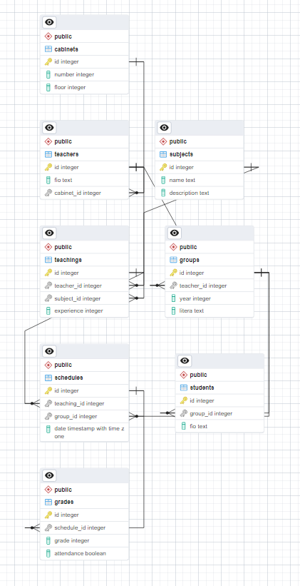

### Список кабинетов:

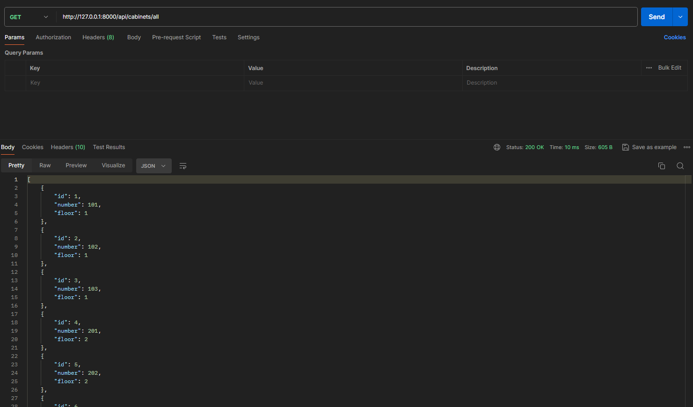

### Информация о кабинете:

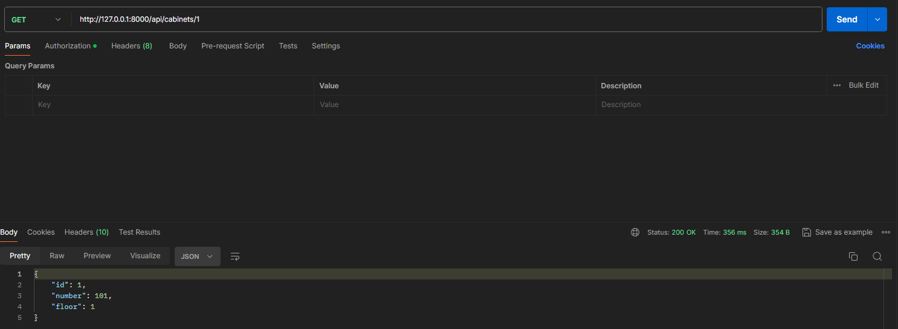

### Создание кабинета:

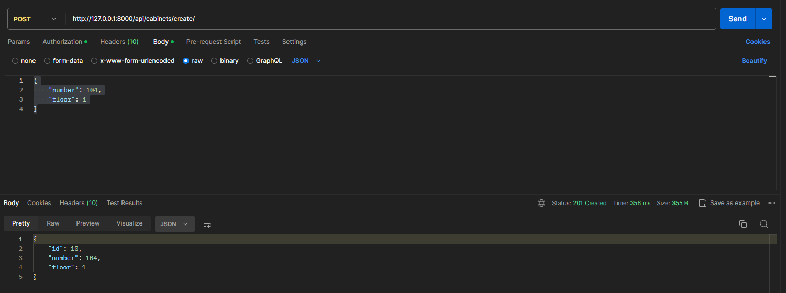

### Обновление кабинета:

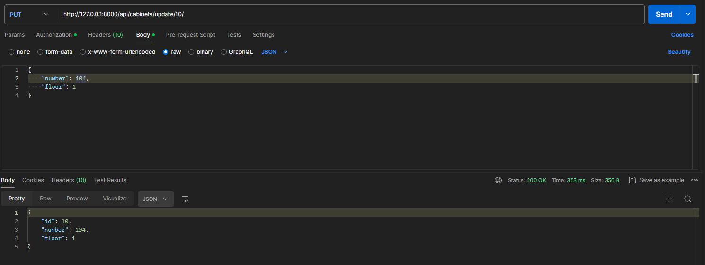

### Удаление кабинета:

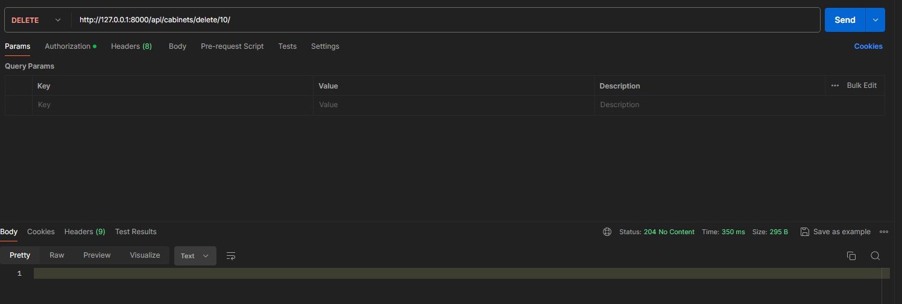

### Список классов:

### Информация о классе:

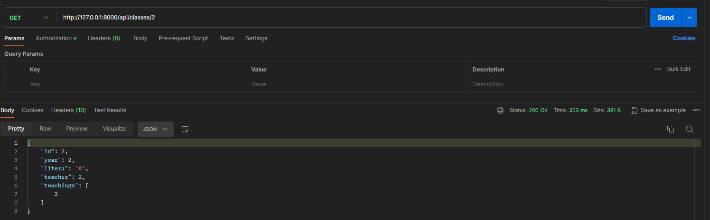

### Создание класса:

### Обновление класса:

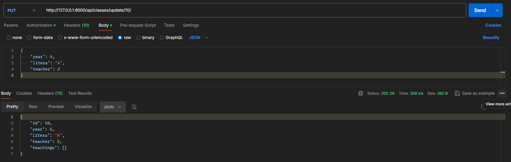

### Удаление класса:

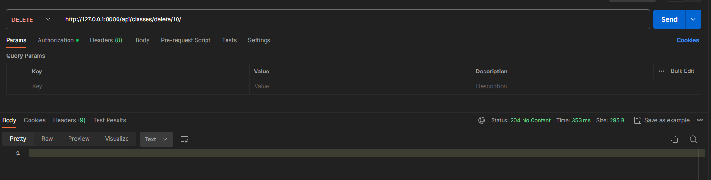

### Список оценок:

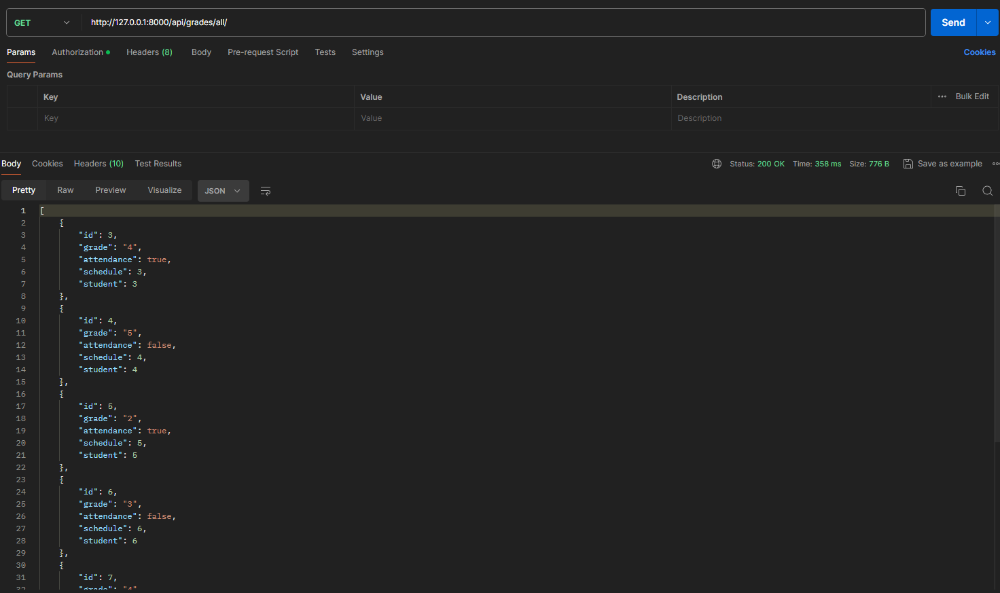

### Информация об оценке:

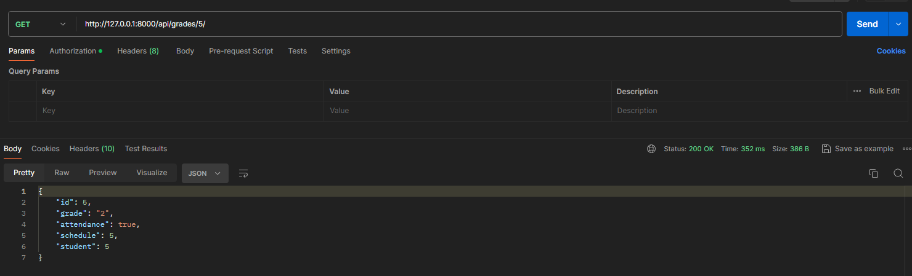

### Создание оценки:

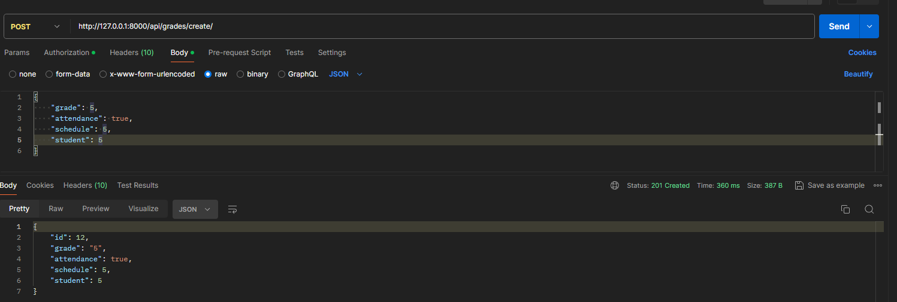

### Обноление оценки:

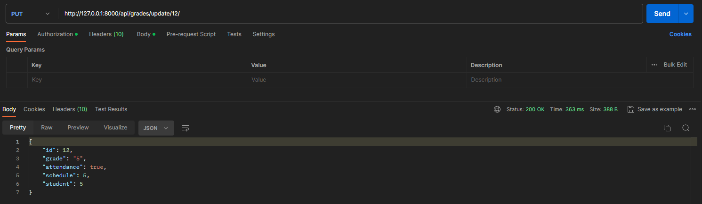

### Удаление оценки:

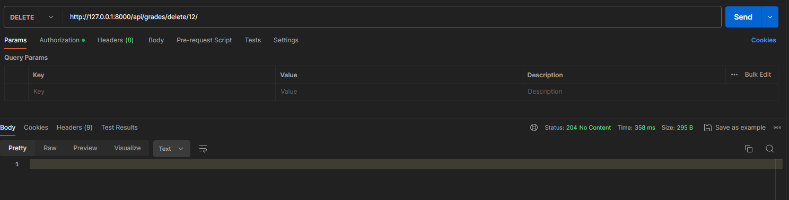

### Список предметов:

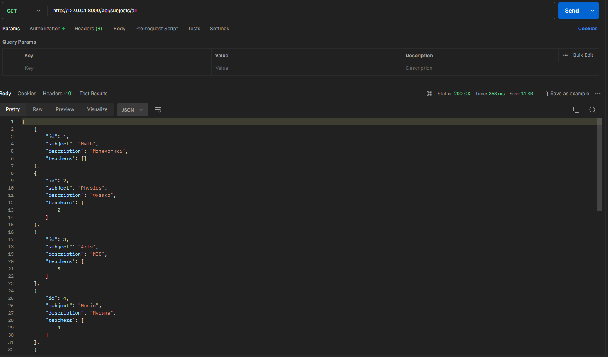

### Информация о предмете:

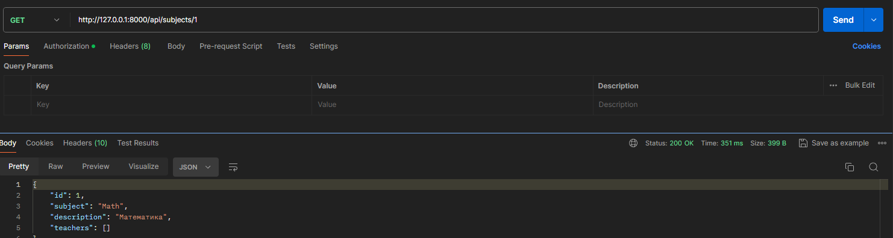

### Создание предмета:

### Обновление предмета:

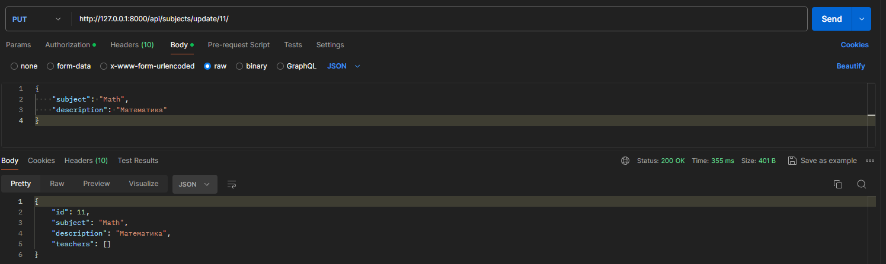

### Удаление предмета:

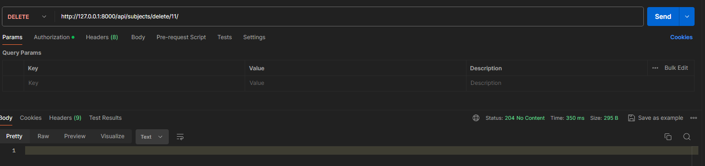

аналогично реализованы методы для других сущностей...