# Практическое задание 3.1

## Задание 1

Напишите запрос на создание 6-7 новых автовладельцев и 5-6 автомобилей, каждому автовладельцу назначьте удостоверение и от 1 до 3 автомобилей. Задание можете выполнить либо в интерактивном режиме интерпретатора, либо в отдельном python-файле. Результатом должны стать запросы и отображение созданных объектов. 

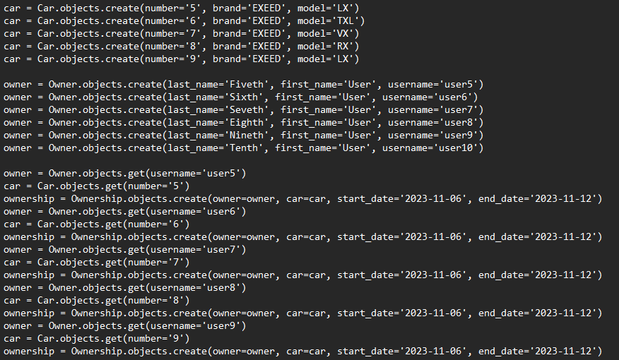
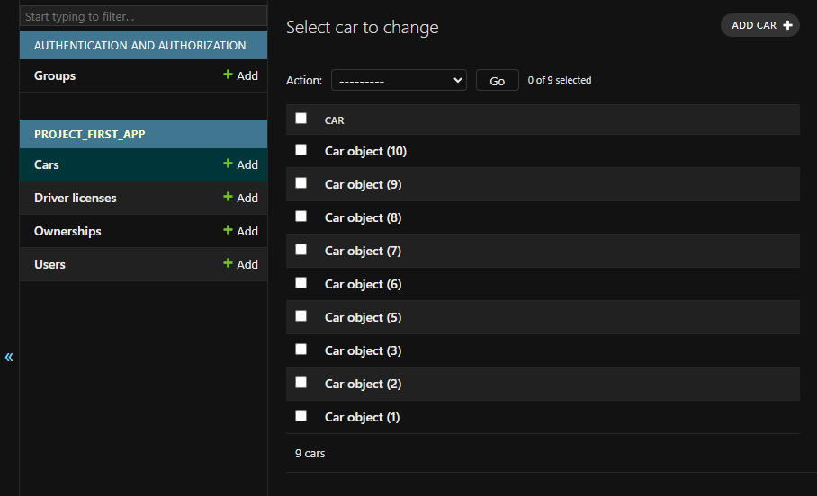
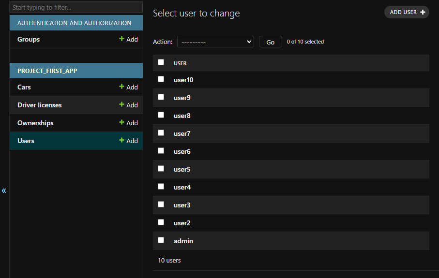
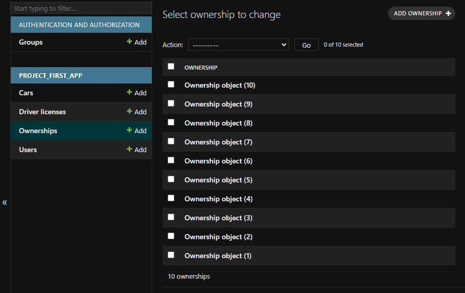

## Задание 2

Выведете все машины марки “Toyota” (или любой другой марки, которая у вас есть)

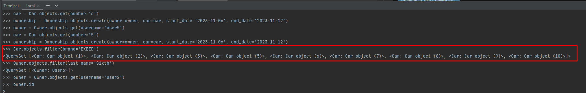

Найти всех водителей с именем “Олег” (или любым другим именем на ваше усмотрение)

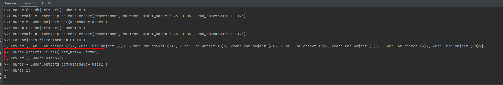

Взяв любого случайного владельца получить его id, и по этому id получить экземпляр удостоверения в виде объекта модели (можно в 2 запроса)

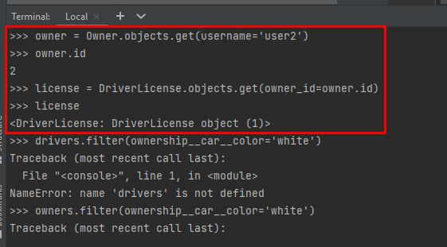

Вывести всех владельцев красных машин (или любого другого цвета, который у вас присутствует)

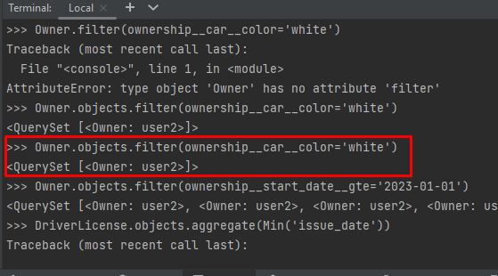

Найти всех владельцев, чей год владения машиной начинается с 2010 (или любой другой год, который присутствует у вас в базе)

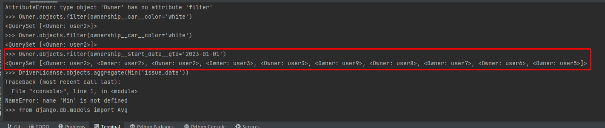

## Задание 3

Вывод даты выдачи самого старшего водительского удостоверения

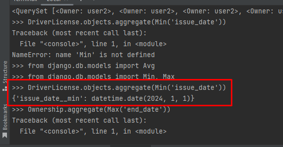

Укажите самую позднюю дату владения машиной, имеющую какую-то из существующих моделей в вашей базе

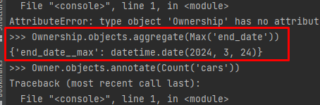

Выведите количество машин для каждого водителя

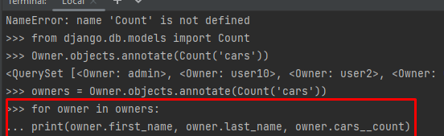
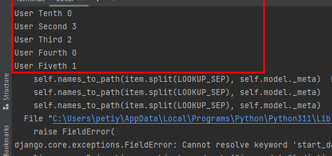

Подсчитайте количество машин каждой марки

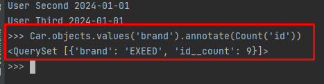

Отсортируйте всех автовладельцев по дате выдачи удостоверения

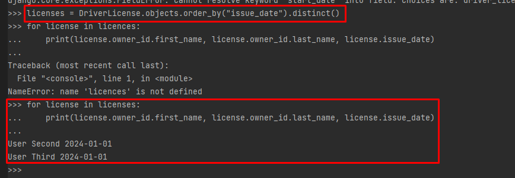
